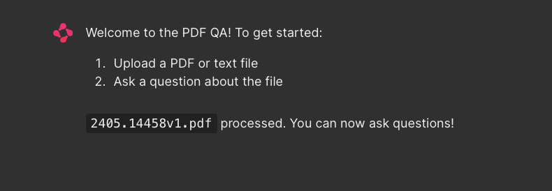

# RAG_chatbot
Chatbot using RAG

1. Clone the repository:
    Open Terminal and enter command
    + For Windows: git clone https://github.com/chaupmbn/RAG_chatbot.git
    + For MacOS: git clone git@github.com:chaupmbn/RAG_chatbot.git
2. Install necessary libraries:
    Use "pip install" to install all the libraries in requirements.txt
3. Open the application:
    chainlit run */RAG_chatbot/chatbot.py (replace * with apprroprriate path)
    If the application open succesfully, it will be like this picture:
    
4. Upload pdf file:
    Click the "Browse files" button and upload your pdf file (up to 20MB).
5. The file will be processed as this sample:
    
6. Type in your question about the uploaded file at the text box at the bottom.